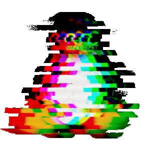

<!--Header Wave-->
<div align="center">
  
</div>

<!--Ghost in the Shell Gif-->


<!-- Greeting -->
<h2 align="right" style="color:#9c40bf">
  👽 Welcome To My Profile
</h2>

<div align="center">
  <a href="https://github.com/JoshuaThadi" target="_blank">
    
  </a>
  
  <a href="https://github.com/joshuathadi?tab=repositories&sort=stargazers" target="_blank">
    
  </a>
  <a href="https://github.com/joshuathadi?tab=followers" target="_blank">
    
  </a>
  <a style="display:block;" href="https://github.com/joshuathadi?tab=repositories&q=&type=source&language=&sort=stargazers">
    
  </a>
</div>

<h2 align="right" style="color:#9c40bf">
  🌐 Please, Select Your Language Here:
</h2>


<div style="display: flex; align-items: center; justify-content: space-around;">
  
  <table style="border-style: dotted">
    <!--Deutsch-->
    <tr>
      <td>
          <a href="langs/README-ger.md">Deutsch</a>
        </td>
    </tr>
    <tr>
      <td>
        <a href="README.md">English</a>
      </td>
    </tr>
    <tr>
      <td>
        <a href="langs/README-esp.md">Español</a>
      </td>
    </tr>
    <tr>
      <td>
        <a href="langs/README-est.md">Esperanto</a>
      </td>
    </tr>
    <tr>
      <td>
        <a href="langs/README-frn.md">Français</a>
      </td>
    </tr>
    <tr>
      <td>
        <a href="langs/README-por.md">Português</a>
      </td>
    </tr>
    <tr>
      <td>
        <a href="langs/README-chi.md">中文</a>
      </td>
    </tr>
    <tr>
      <td>
        <a href="langs/README-kor.md">한국어</a>
      </td>
    </tr>
    <tr>
      <td>
        <a href="langs/README-jpn.md">日本語</a>
      </td>
    </tr>
    <tr>
      <td>
        <a href="langs/README-hin.md">हिन्दी</a>
      </td>
    </tr>
    <tr>
      <td>
        <a href="langs/README-rus.md">Русский</a>
      </td>
    </tr>
  </table>
</div>

<h2 align="right" style="color:#9c40bf">
  🧘🏿‍♂️ About Me
</h2>

<!--#style="display: flex; align-items: center;"-->

> Hello there! I have a degree in Systems Analysis and have been working in technology for several years, combining academic background with constant study related to system development.

> My journey started with computer maintenance, which gave me a solid technical foundation and a comprehensive view of infrastructure and machine functionality.

> I am passionate about Linux. I have knowledge of languages such as Python, TypeScript, and Ruby, focusing on clean, efficient, and scalable solutions. 

> This profile includes projects that reflect my focus on writing clean code, my continuous pursuit of learning, and my commitment to quality. 

> Feel free to explore the repositories, contribute, or contact me via LinkedIn!

> Currently, I am dedicating my time to the field of Information Security, deepening my knowledge in data protection, vulnerability analysis, and best practices in cybersecurity. 

> This new phase complements my technical education and strengthens my commitment to building increasingly secure systems.

<!--Repositories Snake Animation-->
<picture>
  <source
    media="(prefers-color-scheme: dark)"
    srcset="https://raw.githubusercontent.com/platane/snk/output/github-contribution-grid-snake-dark.svg"
  />
  <source
    media="(prefers-color-scheme: light)"
    srcset="https://raw.githubusercontent.com/platane/snk/output/github-contribution-grid-snake.svg"
  />
  
</picture>

<!-- Languages & Tools -->
<h2 align="right" style="color:#9c40bf">
  📚 Tools I've Placed My Hands On
</h2>

<div align="center">
  <br>
  <br>
  <br>
  <br>
</div>

<h2 align="right" style="color:#9c40bf">
  ⌨️ Programming Languages
</h2>

<div align="center">
  
  
  
  
  
  
  
  
  
  
  
  
  
</div>


<!-- Tech Stack -->
<h2 align="right" style="color:#9c40bf">
  💻 Tech Stack
</h2>

<div align="center">

<!-- Languages -->

<a href="https://www.typescriptlang.org/" target="_blank"></a>
<a href="https://reactnative.dev/" target="_blank"></a>
<a href="https://nextjs.org/" target="_blank"></a>
<a href="https://nodejs.org/" target="_blank"></a>
<a href="https://expressjs.com/" target="_blank"></a>
<a href="https://www.mongodb.com/" target="_blank"></a>
<a href="https://www.mysql.com/" target="_blank"></a>
<a href="https://www.postman.com/" target="_blank"></a>
<a href="https://www.prisma.io" target="_blank">
    </a>
<a href="https://supabase.com" target="_blank">
    </a>
<a href="https://clerk.com" target="_blank">
    </a>
<a href="https://numpy.org/" target="_blank">
  </a>
<a href="https://pandas.pydata.org/" target="_blank">
  </a>
<a href="https://scipy.org/" target="_blank">
  </a>
<a href="https://scikit-learn.org/" target="_blank">
  </a>
<a href="https://plotly.com/" target="_blank">
  </a>
<a href="https://keras.io/" target="_blank">
  </a>
<a href="https://pytorch.org/" target="_blank">
  </a>
<a href="https://www.anaconda.com/" target="_blank">
  </a>
<a href="https://jupyter.org/" target="_blank">
  </a>
<a href="https://www.tensorflow.org/" target="_blank">
  </a>
</div>

<!-- GitHub Stats -->
<!--
<h2 style="color:#9c40bf">📊 GitHub Stats</h2>
<div   >
  
  <table>
    <tr>
      <td>
        
      </td>
      <td>
        
      </td>
    </tr>
  </table>
  <table>
    <tr>
      <td>
        
      </td>
      <td>
        
      </td>
    </tr>
  </table>
</div>
-->

<h2 align="right" style="color:#9c40bf">
  Where's My Message to You:
</h2>

```yaml
  quote: 'Sometimes fate is like a small sandstorm that keeps changing directions. You change direction but the sandstorm chases you.'
    
  author: [
    name: 'Haruki',

    surname: 'Murakami',

    birth_location: Japan,

    ocupation: 
      [
        'writer',
        'novelist',
        'translator',
        'runner',
      ]
  ]
  
  book_name: 'Kafka on the Shore'

  publish_year: 2002
```

<h2 align="right" style="color:#9c40bf">
  📬 Where You Can Find Me
</h2>

<div align="center">
  <a href="https://dev.to/hexthersync32" target="_blank">
    
  </a>
  <a href="https://github.com/hexthersync32" target="_blank">
    
  </a>
  <a href="https://www.hackerrank.com/profile/hexthersync32" target="_blank">
    
  </a>
  <a href="https://leetcode.com/u/hexthersync32/" target="_blank">
    
  </a>
  <a href="https://www.linkedin.com/in/lucas-gomes-7a6a091b4" target="_blank">
    
  </a>
  <a href="https://medium.com/@hexthersync32" target="_blank">
    
  </a>
  <a href="https://hexthersync32.github.io/" target="_blank">
    
  </a>
  <a href="https://tryhackme.com/p/krynicak0der" target="_blank">
    
  </a>
</div>

<div align="center">
  
</div>

<p align="center">
  ⚠️ README file designed by <strong>@hexthersync32.</strong>
</p>

<div align="center">
  
</div>